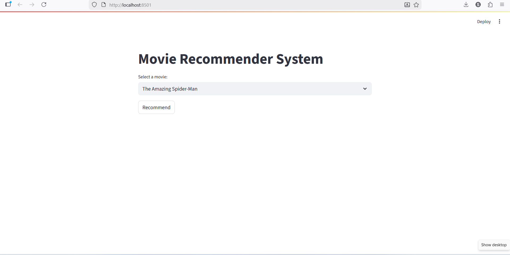
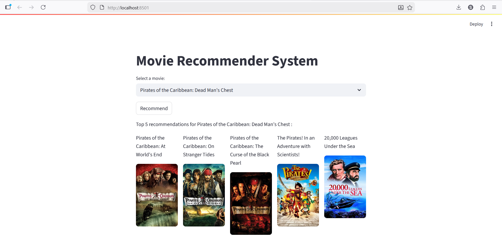

# 🎬 Movie Recommender System (Streamlit Web App)

This project is an end-to-end **Content-Based Movie Recommendation
System** that suggests the top 5 similar movies based on metadata
similarity. The system is built using Python and deployed with
Streamlit, demonstrating how recommendation engines work in real-world
platforms.

------------------------------------------------------------------------

## 🚀 Project Highlights

-   End-to-end ML workflow (data preprocessing → similarity modeling →
    deployment)
-   Content-based filtering using movie metadata
-   Cosine similarity for high-dimensional vector comparison
-   Precomputed similarity matrix for fast recommendations
-   TMDB API integration for real-time movie posters
-   Interactive and user-friendly Streamlit interface

------------------------------------------------------------------------

## 📌 Features Used for Recommendation

The system generates recommendations based on:

-   Movie genres
-   Keywords
-   Cast
-   Crew
-   Movie overview
-   Combined metadata tags

These features are transformed into vector representations to calculate
similarity between movies.

------------------------------------------------------------------------

## 🧠 Core Methodology

The recommendation engine uses **Cosine Similarity** to measure
similarity between movies.

Why cosine similarity?

-   Performs well in high-dimensional spaces
-   Works efficiently with sparse text data
-   Captures similarity in content rather than magnitude

Each movie is converted into a feature vector based on combined
metadata, and the system recommends the five most similar movies based
on similarity scores.

------------------------------------------------------------------------

## 🗂️ Project Structure

-   app.py (Streamlit application)
-   similarity.pkl (Precomputed similarity matrix)
-   movies_dict.pkl (Serialized movie data)
-   Movie_recommender_system.ipynb (Data preprocessing notebook)
-   tmdb_5000_movies.csv (Dataset)
-   tmdb_5000_credits.csv (Dataset)
-   requirements.txt (Dependencies)

------------------------------------------------------------------------

## ▶️ How to Run the Project

### 1️⃣ Clone the Repository

``` bash
git clone https://github.com/shubro-das/movie_recommender_system.git
cd movie_recommender_system
```

### 2️⃣ Install Dependencies

``` bash
pip install -r requirements.txt
```

### 3️⃣ Run the Streamlit App

``` bash
streamlit run app.py
```
------------------------------------------------------------------------

## 🖥️ Application Preview

Screenshots of the recommendation interface and outputs:
### 🔹 Movie Selection Interface


### 🔹 Top 5 Recommended Movies



------------------------------------------------------------------------ 

## 📊 Dataset

The project uses the TMDB 5000 Movies Dataset, which contains:

-   Movie metadata
-   Genres
-   Cast and crew information
-   Keywords
-   Unique movie IDs

The datasets were merged, cleaned, and transformed during preprocessing.

------------------------------------------------------------------------

## 🛠️ Tech Stack

-   Python
-   Pandas
-   Scikit-learn
-   Streamlit
-   TMDB API
-   Pickle
-   Cosine Similarity

------------------------------------------------------------------------

## 🎯 Purpose of the Project

This project demonstrates:

-   Designing a content-based recommendation system
-   Feature engineering from structured and text data
-   Similarity computation using cosine similarity
-   Model serialization for deployment
-   API integration in ML applications
-   Building interactive ML-powered web applications

------------------------------------------------------------------------

## 👨🏻‍💻 Author

Shubro Das\
GitHub: https://github.com/shubro-das
